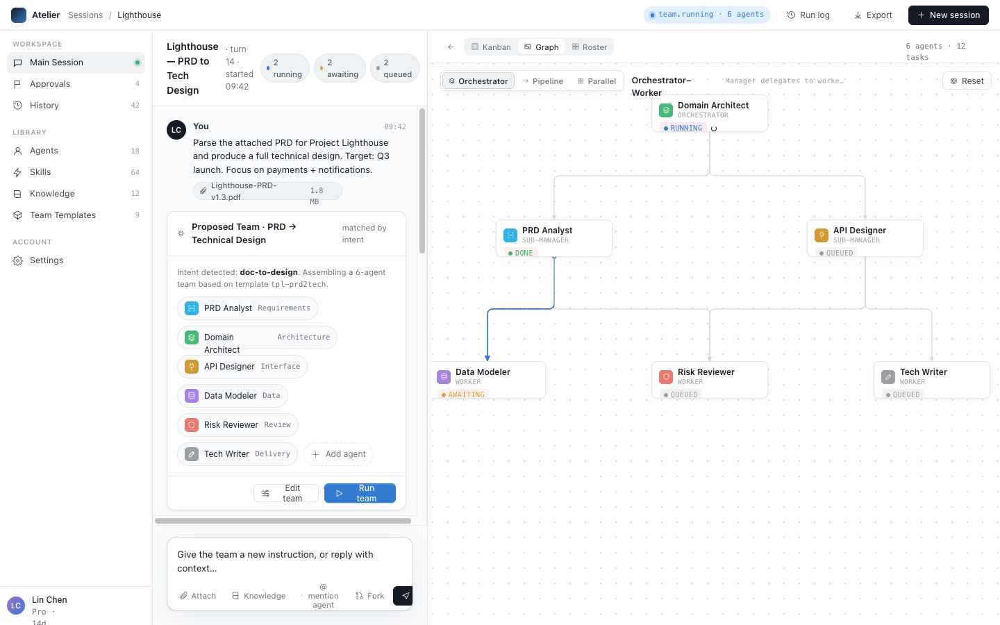
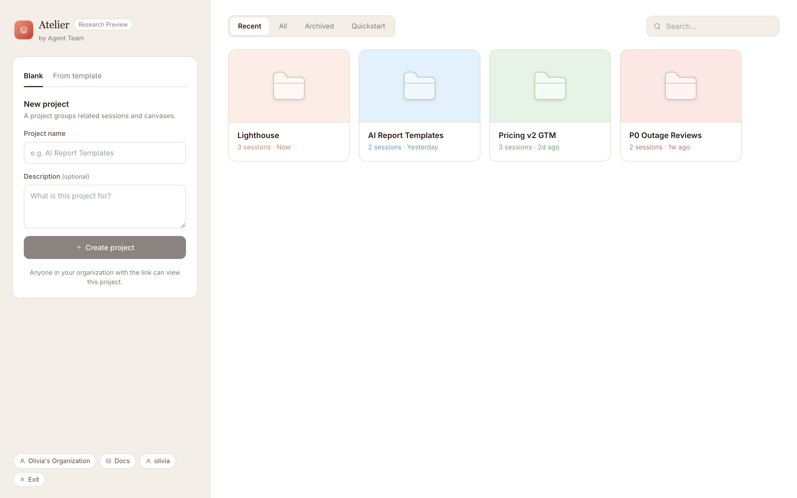
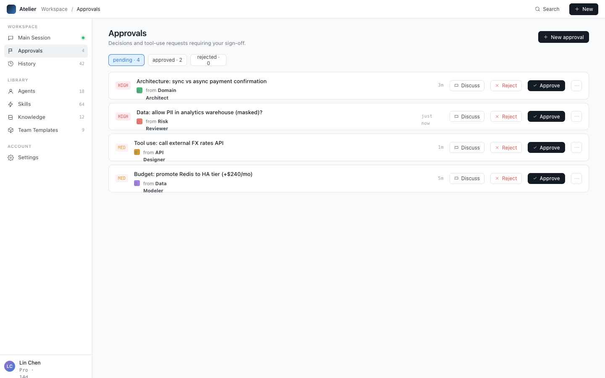

# Atelier

Atelier is a prototype multi-agent workspace UI for planning, running, and reviewing agent teams. It combines a chat-first session view with a live team canvas, CRUD screens for agent assets, approvals, history, and an optional local backend that can persist data and stream Codex CLI runs.

The project is intentionally lightweight. The main UI lives in `packages/frontend/` and is a static React prototype loaded directly from `packages/frontend/index.html` with React 18 and Babel UMD scripts, so it can run without a frontend build step.



## Highlights

- Chat workspace for turning a goal into a proposed multi-agent team.
- Team views for Kanban, graph, and roster-style coordination.
- Management screens for agents, skills, knowledge, templates, approvals, history, and sessions.
- In-memory CRUD behavior for the static prototype.
- Optional Node.js backend with SQLite persistence, WebSocket events, scheduling, and Codex CLI integration.
- Local-only runtime data, dependencies, caches, and generated videos are excluded through `.gitignore`.

## Screenshots

### Project Dashboard



### Agent Team Canvas


### Approvals



## Repository Layout

```text
.
|-- packages/frontend/         # Static React prototype
|-- packages/backend/          # Optional Node.js + SQLite backend
|-- docs/                      # Design notes, plans, and project assets
`-- skills-lock.json           # Agent skill lockfile
```

## Run the Static Prototype

Open `packages/frontend/index.html` directly in a browser, or serve the frontend folder as static files:

```sh
cd packages/frontend
python3 -m http.server 8000
```

Then visit:

```text
http://localhost:8000
```

The static app works with mock data. Entity changes are stored only in browser memory and reset on reload.

## Run With the Optional Backend

The backend requires Node.js 20 or newer.

```sh
cd packages/backend
npm install
cp .env.example .env
npm run dev
```

By default the backend listens on `http://localhost:3001` and creates its local SQLite database under `packages/backend/data/`, which is ignored by git.

The backend serves the frontend from `packages/frontend/`, so you can visit `http://localhost:3001` after `npm run dev`.

When opening the UI from `file://`, `api.js` automatically targets `http://localhost:3001`. If you serve the frontend from another local web server, configure the page to set `window.AGENTTEAM_API_BASE = "http://localhost:3001"` before `api.js` loads, or serve/proxy the backend from the same origin.

## Backend Checks

```sh
cd packages/backend
npm test
```

## Notes

- There is no frontend package manager, bundler, or build command for the static prototype.
- Keep script load order in `packages/frontend/index.html`; each JSX file attaches exports to `window`.
- Do not commit `.env`, `node_modules`, backend databases, workspace runtime files, or generated video renders.
